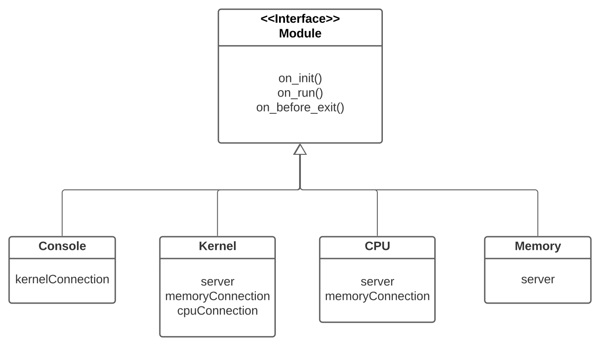
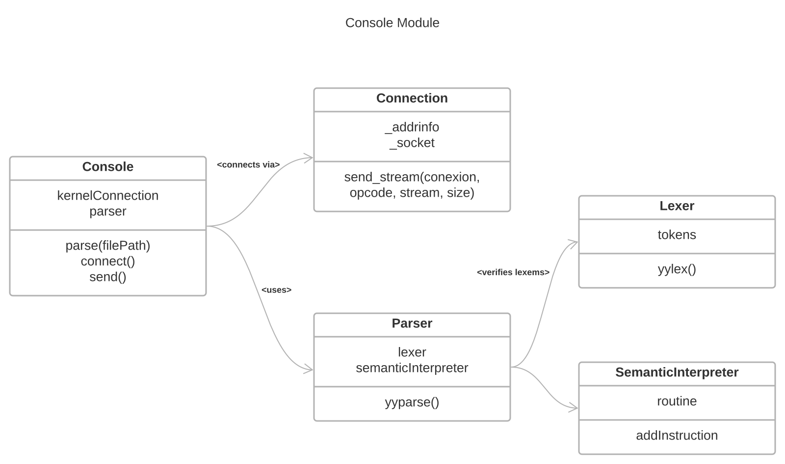
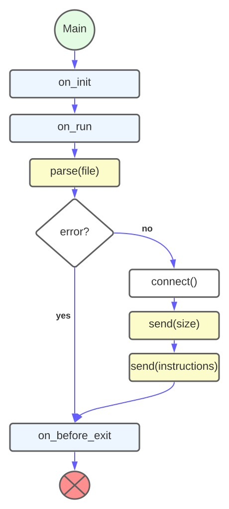

# Operating Systems 1Q-2020

- [Operating Systems 1Q-2020](#operating-systems-1q-2020)
	- [Code for GoOS' KISS Assignment](#code-for-goos-kiss-assignment)
	- [Docs](#docs)
		- [Modules](#modules)
		- [Console](#console)
			- [Design](#design)
			- [Logic](#logic)
	- [License](#license)

##  Code for GoOS' KISS Assignment

[View Requirements](https://docs.google.com/document/d/17WP76Vsi6ZrYlpYT8xOPXzLf42rQgtyKsOdVkyL5Jj0/edit#heading=h.nm1zk6pu7e78)

## Docs

### Modules

### Console

#### Design

#### Logic

## License

All material is provided under an MIT License unless otherwise specified.

MIT License: <https://mit-license.org/> or see the [`LICENSE`](./LICENSE) file.
